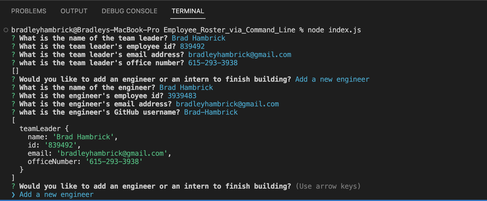
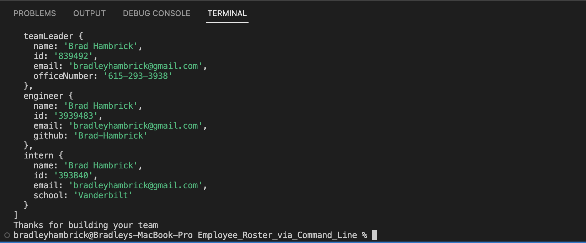
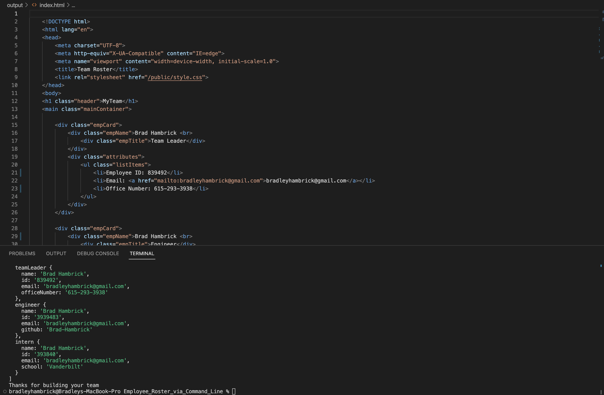
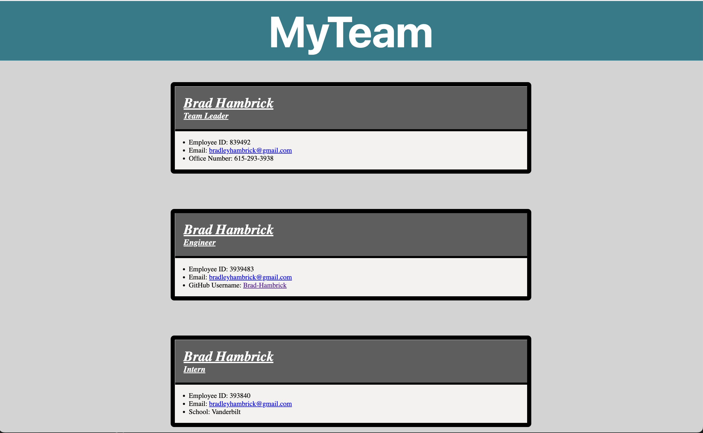

# Employee_Roster_via_Command_Line
This project will generate an employee roster containing their pertinent information with several additional features.

## GitHub Repository
[Employee Roster via Command Line](https://brad-hambrick.github.io/Random_Password_Generator/)

## Description
This project was completed in order give users the ability to easy create a team roster using command line prompts generated via inquirer, node js, and object oriented programming.  

## Badges
There are no licensing requirements for this project.  Shout out to inquirer for development of the prompts.  All CSS was done personally by Brad Hambrick.

## Visuals

## Usage
This project can be used in order for employers or team leaders to quickly and efficiently create a team roster that subsequently generates a user friendly html page that provides links to the team member's GitHub account or email address.  

## Support
For support, contact Brad Hambrick @<a href="mailto:bradleyhambrick@gmail.com">bradleyhambrick@gmail.com</a>

## Roadmap
This project is a basic tool however there may be additional attributes added to the employees.  There may also be additional features added in the future to give users faster access to certain attributes.    

## Contributing
This project is open to recommendations and future contributions.

## Authors and acknowledgment
Thanks to Vanderbilt Coding Bootcamp for contributing to the knowledge required to build this project.

## License
N/A 

## Project status
The project is completed to a point of being operational, however additional features may be added in the future.  
